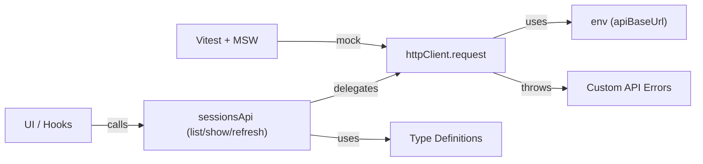

# Design Document — issue-19

## Overview
Codex History のフロントエンドは、Rails 製 API からセッション一覧・詳細・リフレッシュジョブ情報を取得して UI を構築する。現状は薄い `fetcher` ラッパーしか存在せず、エンドポイントごとの型安全性や異常系の扱いが未整備である。本機能では API クライアント層を設計し、共通の HTTP パイプライン・型定義・エラー境界を提供することで、今後の画面実装を TDD で進めやすくする。citeturn0github__get_issue0

対象ユーザーはフロントエンド開発者であり、統一インターフェースを通じてセッションデータ取得・リフレッシュ操作・エラーハンドリングを実装する。結果として UI 層ではドメイン指向の関数呼び出しに集中でき、API 仕様変更にも型シグネチャの差分で追従可能になる。

## Goals
- セッション API 群を型安全な関数として提供し、入力パラメータとレスポンスの整合性を保証する。
- HTTP 通信・リトライ・タイムアウト・エラー変換を共通化し、呼び出し側の重複を除去する。
- TDD を支援するテスト基盤（MSW + Vitest）を整備し、正常系・異常系の挙動を自動化する。

## Non-Goals
- UI コンポーネントや状態管理（SWR/React Query 等）の実装。
- API バックエンドそのものの仕様変更や検索 API（`GET /api/search`）の対応。
- ログ収集やトースト表示などプレゼンテーション層の責務。

## Architecture

### Existing Architecture Analysis
- 既存の `frontend/src/api/client.ts` は fetch をラップし JSON を返すだけで、タイムアウト・再試行・エラー分類を持たない。
- パス解決は `env.apiBaseUrl` を参照し、`vite` のエイリアス（`@/` → `frontend/src`）が設定済み。
- RSpec/Brakeman/Rubocop などの CI 流れは既存設計と一致しており、フロントエンド側では Vitest が導入済みだが MSW は未定義。

### High-Level Architecture

**Architecture Integration**
- 既存の `fetcher` をベースにしつつ、タイムアウト制御やヘッダ設定を `httpClient` に移し、今後のエンドポイント拡張にも対応しやすい分割とする。
- 新規追加モジュールはフロントエンド内で完結し、Rails 側の契約（`data` / `meta` / `errors`）を尊重する。
- Steering の構造方針（サービス層分離、API クライアントの共通化）に準拠し、`frontend/src/api/` 配下に集約する。citeturn0github__get_issue0

## Technology Alignment
- 新依存として `msw` を追加し、Vitest + jsdom でのユニットテストに活用する。`setupTests.ts` でハンドラ登録を行い、既存テストフローと整合させる。
- 共通 HTTP 層はブラウザ標準 `fetch` と `AbortController` を利用し、追加ポリフィルは不要。
- Type 定義は TypeScript の `type` / `interface` を使用し、API レスポンスは API 構造のまま snake_case で保持する。

## Key Design Decisions
- **Decision**: API 呼び出しは `httpClient.request`（汎用）と `sessionsApi`（ドメイン別ファサード）の2層で構成する。  
  **Context**: 直接 fetch を呼ぶとエンドポイントが散らばり、今後の API 拡張や再試行ロジックが重複する。  
  **Alternatives**: (1) 既存 `fetcher` に機能を詰め込む、(2) SWR など状態管理ライブラリに依存する、(3) GraphQL 化。  
  **Selected Approach**: 汎用 HTTP クライアントがタイムアウト・リトライ・エラー分類を担い、ドメイン別モジュールが型付けされたメソッドを提供する。  
  **Rationale**: 既存構造と最も整合し、UI からも簡潔に呼べる。状態管理ライブラリ導入は将来タスクに温存できる。  
  **Trade-offs**: 2 層分の薄い抽象化が増え、モジュール数は増加するが、テスト容易性とメンテ性が向上。

- **Decision**: タイムアウトは `AbortController` と `setTimeout` で実装し、HTTP メソッドごとにデフォルト値（GET: 10s, POST: 15s）を設定する。  
  **Context**: Issue ではタイムアウト値が未決定のため、妥当な初期値を設計段階で提示する必要がある。  
  **Alternatives**: (1) fetch の `signal` を利用せず放置、(2) 外部ライブラリ（axios など）を導入、(3) すべてのリクエストで同一タイムアウト。  
  **Selected Approach**: 標準 API を利用し、メソッドごとのデフォルトで柔軟に制御。ユーザーはオプションで上書き可能。  
  **Rationale**: 追加依存を避けつつ要件を満たし、リクエスト特性に応じて値を調整できる。  
  **Trade-offs**: `AbortController` をサポートしない古いブラウザではポリフィルが必要だが、対象外として割り切る。

- **Decision**: エンドポイントごとに返却する型は API 契約（`data` / `meta` / `errors`）を維持しつつ、必要最小限のユーティリティで整形する。  
  **Context**: camelCase への変換や Date オブジェクト化は UI 層の責務にできる。  
  **Alternatives**: (1) クライアント層で完全にマッピングする、(2) 生のレスポンスをそのまま返す。  
  **Selected Approach**: 共通 envelope を Respect しつつ、メタ情報抽出や Optional handling だけ行う。  
  **Rationale**: 仕様変更時に追従が容易で、UI 側との責務分離が明確。  
  **Trade-offs**: UI 層での変換が若干増えるが、スキーマの透明性が高まる。

## Components and Interfaces

### HTTP Layer (`frontend/src/api/httpClient.ts`)
- `HttpMethod` 型 (`'GET' | 'POST' | ...'`) と `RequestOptions` インターフェース（`timeoutMs`, `retry`, `headers`, `asJson` など）を定義。
- `httpClient.request<T>`:
  - `AbortController` を生成し、タイムアウト時に abort。
  - `retry` オプションに応じて指数バックオフ（例: 200ms, 400ms, 800ms）で再試行（GET のみデフォルト 1 回）。
  - `fetch` 呼び出し後に 2xx 以外なら `ApiClientError` または `ApiServerError` に変換。
  - JSON 解析失敗時は `ApiUnexpectedResponseError`。
- `buildUrl(path, query)` ヘルパーでベース URL 解決とクエリ文字列生成。

### Domain Facade (`frontend/src/api/sessions.ts`)
- `listSessions(params)`:
  - `page`, `per_page`, `sort`, `speaker`, `start_date`, `end_date`, `q` を受け取り、クエリ生成ヘルパーでバリデーション。
  - 戻り値は `SessionsIndexResponse` 型（`data: SessionSummary[]`, `meta: SessionsIndexMeta`, `errors: []`）。
- `getSessionDetail({ id, variant })`:
  - `variant` は `'original' | 'sanitized'` を許可。サニタイズ無しで 422 を受けた場合は `ApiClientError` に meta 情報を載せる。
  - 戻り値は `SessionDetailResponse` 型。
- `requestRefresh()` と `getRefreshStatus(jobId)`:
  - レスポンスは `JobResource`（`data` には status/enqueued_at 等）。
  - 202 応答時には `meta.job` を抽出して返却。

### Type Definitions (`frontend/src/api/types/sessions.ts`)
- `SessionSummary`、`SessionFilterParams`、`SessionMessageSegment`（discriminated union）、`ToolCall`, `ToolResult` 型等を定義。
- `ApiEnvelope<TData, TMeta>` 汎用型で `data`, `meta`, `errors` を表現。
- 既存仕様 (`docs/api_sessions.md`, `docs/refresh_operations.md`) と整合するキー（snake_case）を維持。

### Error Classes (`frontend/src/api/errors.ts`)
- `ApiErrorBase extends Error`（`status`, `body`, `meta` を保持）。
- `ApiClientError`, `ApiServerError`, `ApiNetworkError`, `ApiTimeoutError`, `ApiUnexpectedResponseError`。
- 追加で 422/409 等に対応する `ApiConflictError` などを必要に応じて定義。
- エラーは `isRetryable` フラグで再試行可否を示す。

### Testing Utilities
- `frontend/src/api/__tests__/sessions.test.ts` で MSW を用いた TDD テストを作成。
- `frontend/src/api/testServer.ts` に MSW server 設定を抽出し、`setupTests.ts` から読み込む。

## Error Handling

### Error Strategy
- HTTP ステータスで分類し、`errors[]` の内容（`code`, `title`, `detail`, `meta`）を例外に格納。
- ネットワークエラーは `ApiNetworkError`、タイムアウトは `ApiTimeoutError`。どちらも再試行対象。
- 422（検証エラー）は `ApiClientError` に `invalid_fields` を保持し、呼び出し側がフォームエラー表示に利用できるようにする。
- 409（リフレッシュ競合）は `ApiConflictError` としてエンドポイント固有のハンドリングを可能にする。

### Monitoring
- 現段階ではログ出力や外部監視は導入しない。呼び出し側（UI フック）で `console.error` やトースト通知を行う指針を別途定義する。

## Testing Strategy
- **Unit Tests (Vitest + MSW)**:
  - `listSessions` 正常系: ページネーション・フィルタ適用・meta の検証。
  - `getSessionDetail` 正常系: サニタイズ有無、tool_call セグメントの型検証。
  - `requestRefresh` 202 応答: `data` / `meta` 抽出。
  - 異常系: 400/422（invalid_fields）、500、タイムアウト、ネットワーク断、再試行が実行されること。
- **Integration-Light Tests**:
  - `httpClient` が `AbortController` を用いてタイムアウトする挙動を単体テスト。
  - 再試行ロジックが指定回数で止まること（MSW で意図的にエラー → succeed）。
- **Test Utilities**:
  - `testServer.ts` にハンドラを集約し、シナリオごとに `server.use()` でレスポンスを切り替える。
  - 各テストケースに目的コメントを記載して TDD 手順と整合。

## Open Questions
- タイムアウト・リトライのデフォルト値は合意が必要（提案: GET 10 秒 / 1 回リトライ、POST 15 秒 / リトライなし）。
- 429 や 503 などレート制限系レスポンスに対する再試行ポリシー。
- API レスポンスの `errors[]` が複数要素を持つ場合、クライアントでどこまで集約するか。

