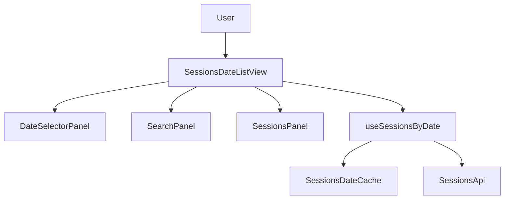
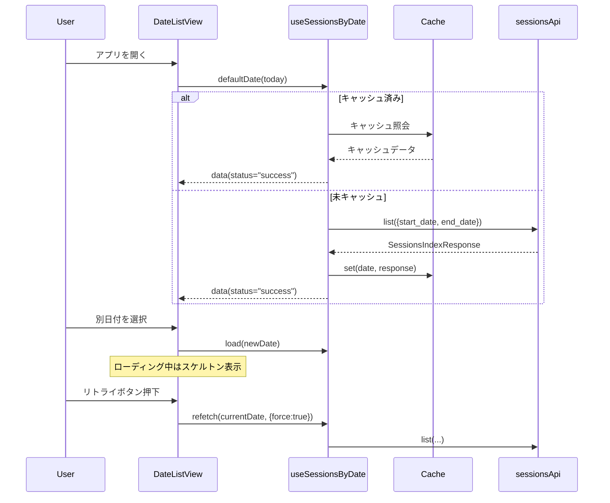
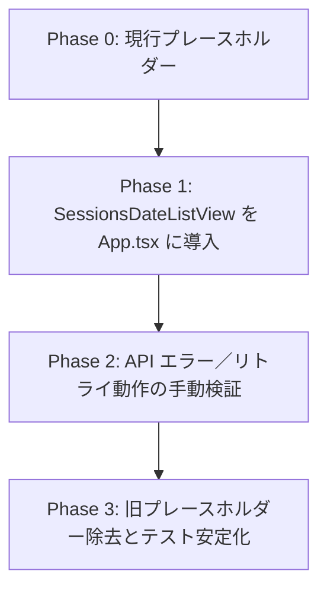

# Design Document

## Overview
Sessions Date List View 機能は、日付ベースで Codex セッションを探したい利用者に対し、当日のセッションを即座に提示しつつ、日付変更・検索準備・状態可視化・リトライを一元的に提供する。初期表示では本日のセッションを自動選択し、カレンダーとカード型リスト、検索入力を通じて目的の会話へ素早く到達できるようにする。
フロントエンドは既存の API クライアント層 (sessionsApi/httpClient) を活用し、日付単位でキャッシュする薄いデータ層を追加する。これにより余分なネットワーク呼び出しを避けつつ、ローディングやエラーに応じた UI 切り替えを実現する。

### Goals
- 当日を既定値としたセッション一覧表示と日付切り替えの実現
- カード形式でのメタデータ提示とセッション詳細への遷移トリガー提供
- 検索入力の状態保持と将来拡張を見据えた UI 準備
- ローディング・エラー・再試行・日付別キャッシュの整備
- MSW/RTL を用いた決定論的なコンポーネントテスト整備

### Non-Goals
- セッション詳細画面のレンダリングやルーティング整備
- 検索入力の実際の API フィルタリング実装
- 無限スクロールや仮想化といった大量データ最適化
- バックエンド API の仕様変更や新規エンドポイント追加

## Architecture

### Existing Architecture Analysis
- 現行の `App.tsx` は静的プレースホルダーを表示しており、API 連携は未実装。
- `frontend/src/api/` 配下には `sessionsApi.list` が存在し、日付・スピーカー・キーワードに対応したクエリ生成 (`buildSessionsIndexQuery`) とエラー型 (`ApiClientError` など) が整備済み。
- グローバル状態管理ライブラリはまだ導入されておらず、アプリ全体は CSS Modules と `setupTests.ts` による MSW サーバを活用する構成。

### High-Level Architecture

### Technology Alignment
- React 19 + TypeScript 5.9 の既存スタック上で構築し、追加ライブラリは導入しない。
- データ取得は既存 `sessionsApi` と `httpClient` を再利用し、再試行やタイムアウト設定を活用する。
- 日付操作はネイティブ `Date` と `Intl.DateTimeFormat` を使用し、外部日付ライブラリは採用しない。
- 検索入力・カレンダー・カードは CSS Modules でスタイルを定義し、アクセシビリティ対応 (`aria-selected`, `aria-pressed`, キーボード操作) を組み込む。カレンダーは WAI-ARIA のガイドラインを踏まえて、ロービジョン利用者にも状態が伝わるよう設計する。citeturn2search7

### Key Design Decisions
- **Decision**: 日付別データを `Map<string, SessionsIndexResponse>` でキャッシュする軽量ストアを導入する。
  - **Context**: 要件4.4で同一日付の再取得を避ける必要がある。
  - **Alternatives**: React Query の導入 / Redux 等のグローバルストア / キャッシュなし都度フェッチ。
  - **Selected Approach**: `useSessionsByDate` 内部で `useRef` による `Map` を保持し、日付キーごとにレスポンスをキャッシュする。
  - **Rationale**: 追加依存を避けつつ要件を満たし、単体テストで制御しやすい。
  - **Trade-offs**: プロセス終了時にキャッシュが消える。長期保管や永続化が必要になった場合は別レイヤーが必要。
- **Decision**: スケルトン UI をセッションカードレイアウトと整合する形で実装する。
  - **Context**: ローディング状態でもレイアウトシフトを抑えたい。
  - **Alternatives**: 単純なスピナー表示 / プレーンテキストの「読み込み中」。
  - **Selected Approach**: セッションカードの高さとメタ情報配置に合わせた骨格ビューを CSS で用意する。
  - **Rationale**: コンテンツ骨格を模倣したスケルトンはユーザーの待機体験を向上させる。citeturn1search0
  - **Trade-offs**: CSS 調整が増える。
- **Decision**: カレンダーセクションを「日付ストリップ + 月切替」構成で構築し、キーボード操作とロービジョン対応を優先する。
  - **Context**: 日付選択はコア要件であり、アクセシブルな操作を求められる。
  - **Alternatives**: ブラウザ標準 `<input type="date">`、外部 UI ライブラリ (MUI DatePicker) の導入。
  - **Selected Approach**: 自前実装でローカル要件（ロケール表示・ショートカット）に最適化。
  - **Rationale**: 依存増を避けつつ、ARIA ロールやラベルを柔軟に制御できる。
  - **Trade-offs**: 実装コストが高く、将来的な再利用には追加抽象化が必要。

## System Flows

## Requirements Traceability
- **要件1**: `SessionsDateListView` + `CalendarStrip` + `useSessionsByDate` の初期日付選択・日付変更ロジックで実現。
- **要件2**: `SessionList` / `SessionCard` コンポーネントと `useSessionCardMeta` (表示用フォーマッタ) によりタイトル・メタ情報・ナビゲーションを提供。
- **要件3**: `SearchInput` 状態と `useSearchDraft` がローカルステート保持を担う。
- **要件4**: `LoadingState`, `ErrorState`, `RetryButton`, `SessionsDateCache` によって状態可視化・再試行・キャッシュを提供。
- **要件5**: `SessionsDateListView.test.tsx` で MSW を用いた統合テストを作成。

## Components and Interfaces

### UI Layer
- `SessionsDateListView`: ルートコンポーネント。`useSessionsViewModel()` から取得した状態を `CalendarStrip`, `SearchInput`, `SessionList`, `StatusBanner` に配信。Props: なし。
- `CalendarStrip`: 月移動と日付選択 UI。Props: `{ activeDate: string; onSelect(dateIso: string): void; onNavigateMonth(offset: number): void; isLoading: boolean; }`。ARIA 属性 (`role="grid"`, `aria-selected`) を設定。
- `SearchInput`: Controlled input。Props: `{ value: string; onChange(value: string): void; placeholder?: string; }`。フォーカス再取得時も value を維持。
- `SessionList`: カード群の表示。Props: `{ sessions: SessionListItem[]; onSelect(id: string): void; variant: 'loading' | 'ready' | 'empty' | 'error'; }`。`variant` に応じて `SessionListSkeleton`/`EmptyState`/`ErrorState` を切り替え。
- `SessionCard`: 単一カード表示。Props: `{ item: SessionListItem; onSelect(id: string): void; }`。タイトル・ファイル名・更新日時・メッセージ数・サマリーを表示。
- `StatusBanner`: エラー/更新情報を表示。Props: `{ error?: FetchErrorView; meta?: SessionsIndexMetaView; onRetry(): void; }`。

### Hooks / Data Layer
- `useSessionsByDate`:
  - 引数: `{ dateIso: string; force?: boolean; }`
  - 返り値: `{ status: 'idle' | 'loading' | 'success' | 'error'; data?: SessionsIndexResponse; error?: ApiErrorBase; refetch(): Promise<void>; }`
  - 内部で `Map<string, CacheEntry>` を `useRef` に保持。`force` またはエラー後リトライ時は API 再呼び出し。
- `useSessionsViewModel`:
  - 内部状態: `{ activeDateIso, searchDraft, lastSuccessfulData }`
  - 副作用: `useEffect` で初期日付ロード。`lastSuccessfulData` はローディング・エラー時のフォールバックとして使用。
- `useSearchDraft`:
  - パラメータ: なし。
  - 返り値: `[draft, setDraft, resetDraft]`。`sessionStorage` は使用せず、コンポーネント存続中のみ保持。

### Utilities
- `dateUtils.ts`:
  - `toISODate(date: Date): string`
  - `parseISODate(iso: string): Date`
  - `formatDisplayDate(date: Date, locale: string): string`
  - `buildCalendarMatrix(baseDate: Date): CalendarCell[][]`
- `navigation.ts`:
  - `navigateToSessionDetail(id: string): void` — ルータ導入前はコールバックをプレースホルダー化。

## Data Models
- `type SessionListItem = { id: string; title: string; fallbackLabel: string; updatedAtLabel: string; messageCount: number; summary?: string | null; hasSanitized: boolean }`
- `type CacheEntry = { response: SessionsIndexResponse; fetchedAt: number }`
- `type FetchErrorView = { kind: 'client' | 'server' | 'network' | 'timeout'; message: string; detail?: string }`
- `type SessionsIndexMetaView = { page: number; totalCount: number; updatedAtLabel?: string }`
- キャッシュは 5 分以上前のデータを再利用対象とし、リトライ時に `force=true` を渡して更新できる設計とする。

## Error Handling

### Error Strategy
- `ApiClientError`: フィルタ入力誤りなどを想定。`meta.invalid_fields` を抽出し、ユーザーへ「日付範囲が不正」といった文言を表示。
- `ApiServerError`/`ApiNetworkError`/`ApiTimeoutError`: 画面上部にエラーバナーを表示し、再試行ボタンを提供。
- 予期しない例外は `console.error` で記録し、ユーザーメッセージは一般化する。

### Error Categories and Responses
- **User Errors (4xx)**: カレンダー範囲エラー → エラーバナー + ハイライト。キャッシュは維持し、フォーム値を初期化しない。
- **System Errors (5xx)**: リトライを推奨し、再試行時は `force=true` で最新データ取得。
- **Business Logic Errors (422)**: メッセージで具体的なフィールド責務を案内。

### Monitoring
- 実装初期はブラウザコンソール記録に留める。後日 Sentry 等を統合できるよう `logError(error: ApiErrorBase)` ヘルパーを設けて呼び出す。

## Testing Strategy
- **Unit Tests**
  - `dateUtils.test.ts`: `buildCalendarMatrix`, `toISODate` の境界ケース (月跨ぎ・閏年)。
  - `useSessionsByDate.test.ts`: キャッシュ再利用、force=true の再取得、エラー後の状態遷移。
  - `SessionCard.test.tsx`: タイトルフォールバック、サマリートリミング (CSS line-clamp 併用) のスナップショット。
- **Integration Tests (MSW + RTL)**
  - `SessionsDateListView.test.tsx`: 初期表示で当日の API 呼び出し + スケルトン表示 → レスポンス後カード表示。
  - 日付変更で `start_date`/`end_date` パラメータが日付に一致することをアサート。
  - 空配列レスポンス時に空状態メッセージが表示されること。
  - ネットワークエラー時のエラーバナーとリトライ挙動。
- **E2E/UI Tests**
  - 将来 Playwright 導入を想定し、ショートカットでの月移動・キーボード操作が動作することをシナリオ化。

## Performance & Scalability
- 1日あたり 100 件程度のカードを想定。CSS による簡易レイアウトで十分なため仮想化は見送る。
- `requestAnimationFrame` を用いたスケルトン描画は不要。CSS トランジションで集中ラインを緩和。
- さらなる高速化が必要になった場合は、複数日をまとめて取得するバッチ API への拡張を設計余地として残す。

## Migration Strategy

- Phase 1: 新コンポーネントを feature フォルダに追加し、App.tsx からレンダリング。
- Phase 2: MSW シナリオと実 API で挙動確認。
- Phase 3: プレースホルダー CSS を削除し、不要なテキストをクリーンアップ。

