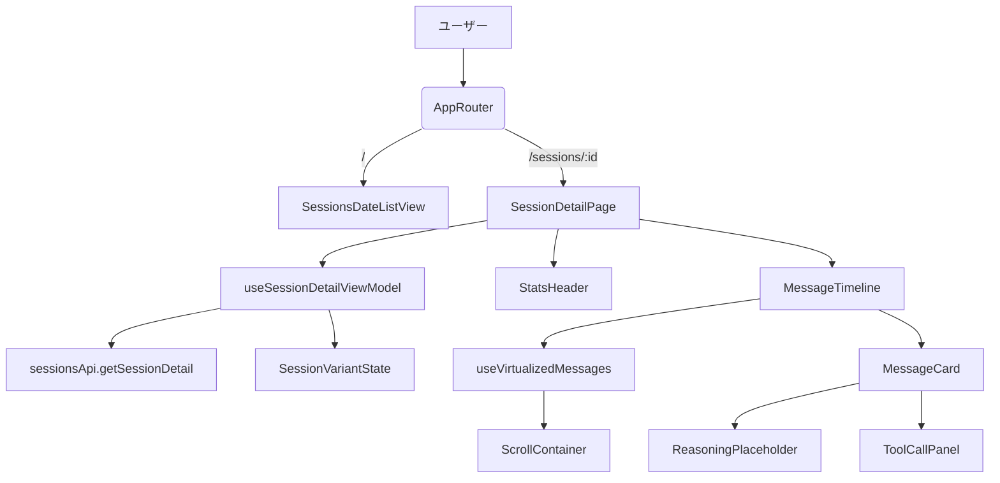
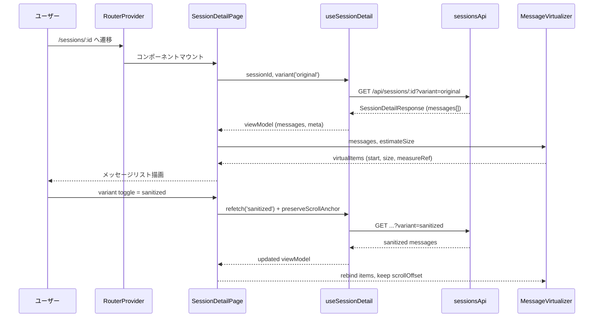
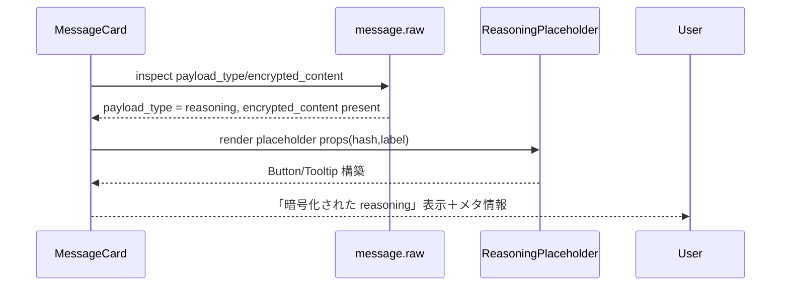
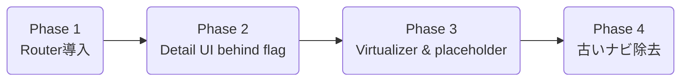

# Design Document

## Overview
Codex History の閲覧者が特定セッションの全文を安全かつ快適に参照できるよう、React 19 + Vite SPA にセッション詳細ビューを追加する。`sessionsApi.getSessionDetail` が返す正規化済みメッセージをロール別に整形し、暗号化 reasoning を露出させずにプレースホルダー表示へ切り替える。大量メッセージでは TanStack Virtual による仮想スクロールを適用し、サニタイズ済みテキストと遅延ロードの組み合わせで長文でも滑らかな UX を実現する。

### Goals
- セッション詳細ルート (`/sessions/:sessionId`) でメッセージ本文・メタ情報・ツール呼び出しを時系列表示する。
- 暗号化 reasoning とサニタイズ variant 切替の UI を提供し、情報露出を制御する。
- 500 行級メッセージでも 60fps を維持できる仮想スクロール実装とテストを整備する。

### Non-Goals
- 検索機能やフィルタリング UI の新設。
- バックエンド API スキーマ変更（既存 `sessions#show` をそのまま利用）。
- WebSocket 等によるリアルタイム反映。今回の detail view は静的取得のみを対象とする。

## Architecture

### Existing Architecture Analysis
- `frontend/src/app/App.tsx` は単一ビュー (`SessionsDateListView`) をレンダリングし、React Router を未導入。セッション選択後の遷移は `navigateToSessionDetail` プレースホルダーが `console.info` を出すのみ。
- API 層は `sessionsApi.getSessionDetail` / `SessionDetailResponse` 型が既に存在し、`message.segments`・`tool_call` 等のフィールドを提供する。
- CSS Modules + Vitest 構成が整っており、MSW による API テストも活用済み (`sessions.msw.test.ts`)。この枠組みを detail view でも踏襲する。

### High-Level Architecture


### Technology Alignment
- **React Router DOM 7.x** を新規導入し、`createBrowserRouter` + `RouterProvider` の Data Router モードでページ遷移とエラーバウンダリを統一管理。`navigateToSessionDetail` は `useNavigate` を利用する軽量ラッパーに差し替える。
- **@tanstack/react-virtual 3.13.x** を採用し、メッセージリストを headless 仮想化。`useVirtualizer` + `measureElement` で可変高さメッセージにも対応する。
- 既存スタック（TypeScript strict, CSS Modules, Vitest + Testing Library, MSW）に準拠し、追加のグローバル状態管理ライブラリは導入しない。

### Key Design Decisions
1. **Data Router でのルート分離**
   - *Context*: 既存ビューは 1 ページ構成で detail 表示の導線がない。
   - *Alternatives*: (a) `window.location` 手動更新、(b) URL クエリのみで条件分岐。
   - *Selected*: `createBrowserRouter` に `/` と `/sessions/:sessionId` を定義し、ページ遷移時に `RouterProvider` が Suspense/エラーバウンダリを処理。
   - *Rationale*: URL ベースで直接アクセスでき、後続の breadcrumb や共有 URL に対応しやすい。
   - *Trade-offs*: 依存パッケージ増加。ルーター初期化が必要となる。

2. **TanStack Virtual による headless 仮想化**
   - *Context*: 500+ 行のメッセージで DOM ノードが膨らむ。
   - *Alternatives*: (a) CSS `contain`+`overflow` で簡易最適化、(b) 自作仮想スクロール実装。
   - *Selected*: `@tanstack/react-virtual` の `useVirtualizer` を利用し、`getItemKey` に message ID、`measureElement` で高さ計測、`overscan=8` を初期値にする。
   - *Rationale*: 可変高さ対応済みで、メンテナンスコストを抑えられる。
   - *Trade-offs*: 追加依存のバンドルサイズ増、Hook 理解コスト。

3. **暗号化 reasoning の専用レンダラー**
   - *Context*: API は `raw.encrypted_content` を保持し、平文出力禁止。
   - *Alternatives*: (a) 完全非表示、(b) JSON をそのまま出力。
   - *Selected*: `ReasoningPlaceholderCard` を挿入し、ハッシュや件数のみ可視化。`raw.encrypted_content` はクライアントで文字列長のみ利用し本文は描画しない。
   - *Rationale*: 利用者に「非表示理由」を明確化しつつ秘匿性を保てる。
   - *Trade-offs*: 詳細確認には今後の監査 UI 拡張が必要。

## System Flows

### シーケンス: セッション詳細ロード


### シーケンス: reasoning プレースホルダー


## Requirements Traceability
| Requirement | 概要 | 主担当コンポーネント | インターフェース | 関連フロー |
| --- | --- | --- | --- | --- |
| R1 (メッセージ表示) | セッション詳細をロール順・タイムスタンプ昇順で表示 | `SessionDetailPage`, `MessageTimeline`, `MessageCard` | `sessionsApi.getSessionDetail`, `SessionMessageViewModel` | Detail Load |
| R2 (reasoning プレースホルダー) | 暗号化 reasoning をマスクし明示 | `ReasoningPlaceholderCard`, `MessageMetadataBadges` | `message.raw.payload_type`, `encrypted_content` | Reasoning Placeholder |
| R3 (仮想スクロール) | 長文リストを仮想化＆遅延ロード | `MessageVirtualizer`, `useVirtualizedMessages` | `@tanstack/react-virtual` hooks | Detail Load |
| R4 (TDD 品質) | レンダリング要件と仮想化挙動をテスト | `*.test.tsx`, `msw` シナリオ | Vitest + Testing Library, MSW | TDD ループ |

## Components and Interfaces

### ルーティング層
- **AppRouter** (`frontend/src/app/AppRouter.tsx`)
  - `createBrowserRouter` で `{ path: '/', element: <SessionsDateListView /> }` と `{ path: '/sessions/:sessionId', element: <SessionDetailPage /> }` を定義。
  - ルートごとに `errorElement` を設定し、API 例外を `SessionDetailErrorBoundary` へ委譲。
- **useSessionNavigation**
  - `useNavigate` を内包し、`navigateToSessionDetail(id: string)` に置き換える。
  - 既存 `SessionsDateListView` では `onSelect` 内で本 Hook を使用。

### セッション詳細機能
- **SessionDetailPage**
  - URL パラメータ（`sessionId`）と `variant` state（'original' | 'sanitized'）を管理。
  - `useSessionDetailViewModel` からデータ取得し、Header / Toolbar / MessageTimeline にプロップス展開。
  - スクロール要素 ref を `MessageVirtualizer` に渡す。
- **SessionStatsHeader**
  - セッションタイトル、`message_count`, `tool_call_count`, `duration_seconds`, `lastUpdatedLabel` を表示。
  - `ReasoningCountBadge` や `VariantSwitch` を内包。
- **SessionVariantSwitch**
  - `hasSanitizedVariant` が true のときだけ表示。
  - `variant` state を更新し、`useSessionDetailViewModel` に `refetch({ variant })` を依頼。
- **MessageTimeline**
  - `messages: SessionMessageViewModel[]` と `virtualizerState` を受け、DOM を構築。
  - 役割別スタイル（user/assistant/tool/meta）と `timestamp` ラベルの整形を担当。
- **useSessionDetailViewModel**
  - 入力: `{ sessionId: string, variant: SessionVariant }`。
  - 出力: `{ status: 'idle'|'loading'|'success'|'error', messages, summary, meta, error }`。
  - `AbortController` で競合リクエストをキャンセルし、variant 切替時にスクロール位置を保持する `preserveScrollAnchor()` を公開。
- **useVirtualizedMessages**
  - 入力: `{ messages, scrollElementRef }`。
  - 内部で `useVirtualizer({ count: messages.length, getItemKey: (index) => messages[index].id, estimateSize })` をセットアップ。
  - `estimateSize` はチャネル別ヒューリスティクス（input=80px, output=120px, tool=140px, meta=64px）を返し、`virtualRow.measureElement` を `MessageCard` に付与して実測を反映。
- **SessionDetailContext**
  - `React.Context` を用い、`messages`, `variant`, `toggleVariant`, `preserveScrollAnchor` を下位ツリーへ提供。`MessageTimeline` 内で利用。
- **MessageCard**
  - `SessionMessageViewModel` を受け、セグメント本文、ツール入出力、メタ情報を描画。
  - サニタイズ済み HTML を `dangerouslySetInnerHTML` ではなく `parse` せず `<span>{text}</span>` で表示（API 側でサニタイズ済み、二重エスケープ防止のため `text` をそのまま表示）。
  - `segments.length === 0` かつ `sourceType === 'meta'` で `ReasoningPlaceholderCard` を差し込む。
- **ReasoningPlaceholderCard**
  - 表示項目: 暗号化済みである旨、`message.raw.encrypted_content` の SHA-256（クライアント計算）長、ハッシュ値先頭 8 文字。
  - 「詳細」トグルで説明ツールチップを表示するが本文は常にマスク。
- **ToolCallPanel**
  - `tool_call` / `tool_result` を折りたたみ可能な JSON 表示（`<pre>` + `JSON.stringify(output_json, null, 2)`）。
- **SessionDetailSkeleton & EmptyState**
  - 読み込み中 / メッセージ 0 件 / エラー時の UI を提供。
- **SessionDetailErrorBoundary**
  - `ErrorInfo` をロギングし、`retry` ボタンから `useNavigate(-1)` もしくは `VM.refetch()` を実行可。

### 補助モジュール
- **scrollAnchor.ts**
  - `captureAnchor(scrollEl)` / `restoreAnchor(scrollEl, anchor)` を実装し、variant 切替や refetch 後にスクロール位置を近似維持。
- **formatters.ts**
  - `formatTimestamp(timestamp, locale)`、`roleLabel(role)`、`channelLabel(channel)` などの純関数を格納。

## Data Models
```ts
export type MessageChannel = 'input' | 'output' | 'meta'

export interface SessionDetailViewModel {
  sessionId: string
  title: string
  variant: 'original' | 'sanitized'
  stats: {
    messageCount: number
    reasoningCount: number
    toolCallCount: number
    durationSeconds: number
    completedAtLabel?: string
  }
  meta: {
    relativePath: string
    downloadUrl: string
    lastUpdatedLabel?: string
  }
  messages: SessionMessageViewModel[]
}

export interface SessionMessageViewModel {
  id: string
  timestampLabel?: string
  role: 'user' | 'assistant' | 'tool' | 'system' | 'meta'
  sourceType: 'message' | 'tool_call' | 'tool_result' | 'meta' | 'session'
  channel: MessageChannel
  segments: RenderedSegment[]
  toolCall?: ToolCallViewModel
  isEncryptedReasoning: boolean
  encryptedChecksum?: string
}
```
`RenderedSegment` には `{ htmlText: string; format: string }` を保持し、`dangerouslySetInnerHTML` は使わずテキストノードとして描画する。`ToolCallViewModel` は `callId`, `name`, `argumentsJson`, `status`, `resultJson` を含む。

## Error Handling
- **HTTP 4xx**: `sessionsApi` の `ApiClientError` を捕捉し、`SessionDetailErrorBoundary` がエラーコード・meta を表示。`not_found` の場合は「存在しないセッション」モーダルとし、`Back to list` ボタンで `/` に戻す。
- **HTTP 5xx / Timeout**: `ApiServerError` と `ApiTimeoutError` を区別し、ユーザーに再試行ボタンを提示。再試行時は `refetch({ force: true })` を呼び、`useSessionDetail` が内部 `retryCount` をリセット。
- **Sanitized variant unavailable**: `has_sanitized_variant=false` で `SessionVariantSwitch` を disable、variant API 呼び出しを抑制。
- **Virtualizer measurement failure**: `measureElement` が null の場合は `estimateSize` のみで描画し、コンソール警告を出す。
- **Reasoning placeholder**: `encrypted_content` が存在しないケースはプレースホルダーを非表示にして通常メッセージ扱い。

### Monitoring
- 重要エラー (`ApiServerError`, `ApiTimeoutError`) を `console.error` に加えて将来のログ基盤へ送信しやすいよう `logClientError({ scope: 'SessionDetailPage', ... })` ヘルパーを実装。
- Virtualizer の `isScrolling` state を `useEffect` で監視し、スクロール停止後に `prefetch` を呼ぶ余地を確保。

## Testing Strategy
- **Hook 単体**
  - `useSessionDetailViewModel.test.ts`: variant 切替時のデータ置換・キャンセル制御、エラー時の状態遷移を Red→Green→Refactor で実装。
  - `useVirtualizedMessages.test.ts`: `count` や `estimateSize` の境界値、`overscan` 設定。
- **Component テスト**
  - `SessionDetailPage.test.tsx`: 初回レンダリング、variant トグル、ツール結果折り畳み、reasoning プレースホルダーの可視性。
  - `MessageTimeline.test.tsx`: 役割別クラス適用と idempotent 渲染。
- **MSW 統合**
  - 成功, 404, 409, 500 シナリオを `msw` で再現し、UI 応答を検証。
- **パフォーマンステスト（軽量）**
  - `vitest` で 1,000 メッセージモックを流し、virtualizer の DOM ノード数が可視範囲 + overscan に収まることを検査。
- **アクセシビリティ**
  - ロールラベル、variant switch、ツールパネルが適切な ARIA 属性を持つかを `@testing-library/jest-dom` で確認。

テストは TDD 原則（Red → Green → Refactor）に従い、Hook/コンポーネント順にケースを積み上げる。

## Security Considerations
- デフォルト表示は `variant='original'` だが、ユーザー操作で `sanitized` に切り替え可能。サニタイズ不足による XSS を防ぐため、`segments.text` をエスケープしたままプレーンテキストとして描画し、HTML を解釈しない。
- Reasoning placeholder では `encrypted_content` をハッシュ化し、元文字列を DOM へ流さない。
- ダウンロードリンク (`meta.links.download`) を `rel="noopener"` 付きアンカーで表示し、外部リンク悪用を防止。
- Router 導入後は公開ルートの 404 応答を明示し、潜在的な route-based 探索攻撃を抑止。

## Performance & Scalability
- Virtualizer 初期設定: `estimateSize` を役割別に調整、`overscan=8`, `scrollPaddingStart=timestampHeight`, `scrollingDelay=75` ms。
- メッセージ数 0〜120: 仮想化をスキップしシンプルに描画（オーバーヘッド削減）。
- `preserveScrollAnchor`: variant 切替時に `anchorRatio = scrollTop / scrollHeight` を保持し、再描画後に `scrollHeight * anchorRatio` へ復元。
- `requestIdleCallback` で `JSON.stringify` を実行し、ツール結果の整形によるメインスレッド阻害を抑える。

## Migration Strategy
1. **Router 導入**: `AppRouter` を作成し、`App.tsx` で `RouterProvider` を返す。既存 list view は `/` ルートに移設。
2. **Detail UI behind feature flag**: `SessionDetailPage` と関連 Hook を追加し、ナビゲーションだけ有効化。QA で表示確認。
3. **仮想化・プレースホルダー適用**: 大量メッセージ fixture を用意し、virtualizer と reasoning UI を順次オンにする。
4. **Old navigation cleanup**: 旧 `navigateToSessionDetail` プレースホルダーを削除し、`useSessionNavigation` へ完全移行。



各フェーズで lint/test を通し、リリース前に `docker compose run --rm backend bundle exec rspec` / `rubocop` / `brakeman` / `npm run test` を再確認する。
