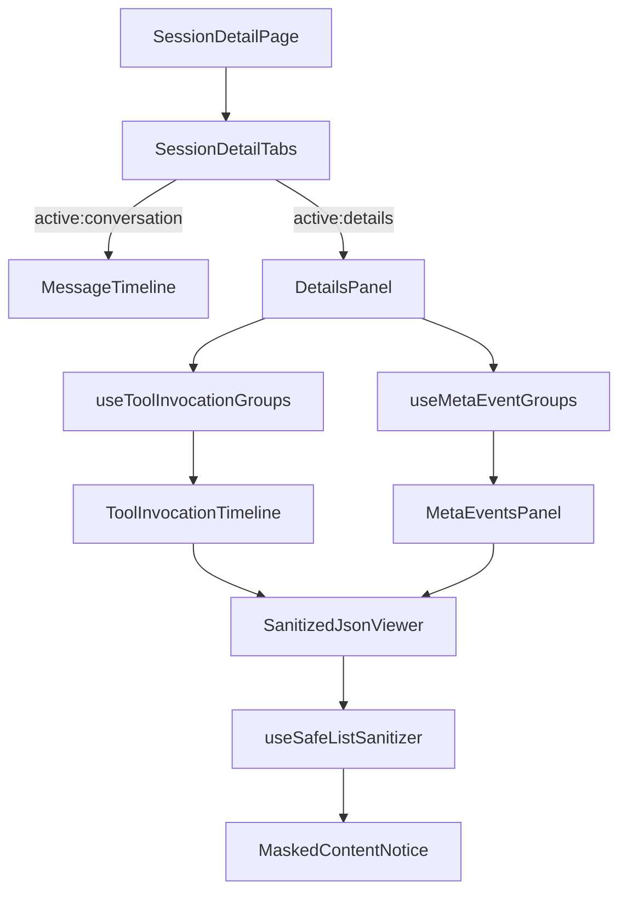
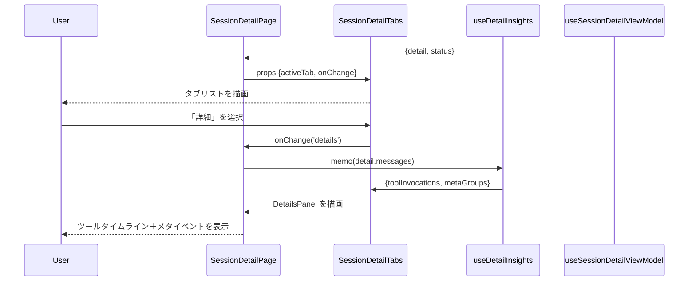
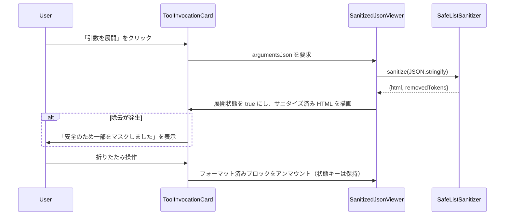

# Design Document

## Overview
Issue #22 は既存のセッション詳細ビューに「詳細」タブを追加し、ページ遷移なしでツール呼び出し履歴やメタイベントを閲覧できるようにする。既に取得済みの `SessionDetailResponse` を再利用し、`call_id` で束ねたツール呼び出し群と `event_msg` のカテゴリ別ペイロードをビューモデルへ拡張する。SafeList 方式のサニタイザと折りたたみ可能な遅延ビューアを組み合わせることで、JSON や HTML 断片を安全に表示しつつ可読性を維持する。これにより、インシデント対応者やパワーユーザーは Codex がツールを実行した理由・所要時間・付随テレメトリをトレースしつつ、issue-21 で提供したメッセージタイムライン UX を損なわずに閲覧できる。

### Goals
- 追加の API 呼び出しを発生させず、会話メッセージと技術的トレースを切り替えられるアクセシブルなタブ切替 UI を提供する。
- `function_call*` / `custom_tool_call*` 系イベントを `call_id` 単位で集約し、引数・出力・ステータス・タイミングを折りたたみカード内に表示する。
- `event_msg` を kind（token_count・agent_reasoning・environment_context など）別にグルーピングし、バッジや要約を提示する。
- 詳細タブ内で表示するすべての JSON / HTML ブロックに SafeList サニタイザを適用し、マスク発生時にはユーザーへ通知する。
- 既存の Vitest スタックに統合した TDD（ユニット＋統合テスト）でタブ制御・集約ロジック・サニタイズ・状態復元をカバーする。

### Non-Goals
- バックエンドのレスポンス形式を変更したり、新規 API を追加すること。
- issue-21 で実装済みの SessionDetail タイムラインや仮想スクロール戦略を置き換えること。
- タブ選択状態をブラウザセッションを跨いで永続化すること（セッション内のメモリ保持で十分）。
- Redux / Zustand 等のグローバル状態管理や重量級 JSON ビューアを導入すること。

## Architecture

### Existing Architecture Analysis
- `SessionDetailPage` はヘッダ統計・バリアント切替・`useSessionDetailViewModel` 由来の仮想化タイムラインを描画済み。
- `mapResponseToViewModel` はメッセージ配列に `tool_call` / `tool_result` の生データを含むが、集約済みツール呼び出しや raw メタイベントはまだ露出していない。
- CSS Modules とローカルフック（`useSessionDetailViewModel`, `SessionVariantSwitch`）が UI 状態を管理しており、サブビュー切替のためにルーター再読み込みは不要。
- サニタイズはメッセージ本文の sanitized variant 依存であり、任意 JSON / HTML 断片向けのフロントエンド SafeList ユーティリティは存在しない。

### High-Level Architecture


### Technology Alignment
- React 19 + TypeScript 5.9 + CSS Modules + Testing Library/Vitest という既存スタックの範囲に収め、タブ状態以外のルーター変更は行わない。
- `DOMParser` と明示的な AllowList（許可タグ: `pre`, `code`, `strong`, `em`, `span`, `a`, `ul`, `ol`, `li`, `table`, `tbody`, `tr`, `td` / 許可属性: `href`, `rel`, `target` のみ）を用いた軽量 `safeHtml` ヘルパーを新設し、大型ライブラリへ依存せずにバックエンド SafeList と同等ポリシーを再現する。
- JSON 表示は `JSON.stringify(value, null, 2)` をベースに CSS でシンタックスハイライトを行い、巨大ペイロードはビューワ単位で遅延マウントする。
- 状態管理はローカル完結とし、アクティブタブは `useState`、集約結果は `useMemo`、折りたたみ状態は `call_id` / event id をキーにした `useRef` マップで保持する。

### Key Design Decisions
1. **ツール呼び出しのクライアント集約レイヤー**
   - *背景*: 生の `messages` では `tool_call` と `tool_result` が交互に現れ、利用側での突き合わせが必要。
   - *選択肢*: (a) 各メッセージ内で個別表示を続ける、(b) バックエンドに集約コレクションを追加してもらう。
   - *決定*: `mapResponseToViewModel` を拡張し、引数/結果メタ情報とタイムスタンプ由来の所要時間を含む `insights.toolInvocations[]` を生成する。
   - *理由*: API コスト増を避けつつ決定論的なグルーピングを実現し、将来的な分析機能にも再利用できる。
   - *トレードオフ*: マッピング時の CPU 負荷がわずかに増えるため、ペアリングロジックを守るユニットテストが必須。

2. **DOM 走査ベースの SafeList サニタイザ**
   - *背景*: ツールの I/O にはログ由来の HTML / リンクが含まれ、variant に関わらず XSS を排除したい。
   - *選択肢*: (a) `dompurify` へ依存、(b) 完全プレーンテキスト表示、(c) カスタムサニタイザ。
   - *決定*: バックエンド AllowList を模したカスタムサニタイザを実装し、大型依存を避けながらオフラインでも決定論的な挙動を確保する。
   - *理由*: 依存削減とポリシー統一、テスト容易性を両立できる。
   - *トレードオフ*: AllowList の保守コストが発生し、除去ルールの単体テストが必要。

3. **遅延展開する JSON ビューアと状態保持**
   - *背景*: 一部ツール呼び出しは 10KB 超の JSON を返し、全件同時レンダリングはパフォーマンスに悪影響。
   - *選択肢*: (a) 常時展開、(b) リスト自体を仮想化、(c) エントリ単位で遅延展開。
   - *決定*: 初期状態ではサマリー行のみを表示し、展開トグル操作時に整形＋サニタイズを実行。折りたたみ状態は `call_id` / event id をキーに保持し、variant 再取得やタブ再描画後も復元する。
   - *理由*: DOM 軽量化と要件の「状態保持」を両立でき、既存の React パターンに沿う。
   - *トレードオフ*: バリアント切替時に状態リセットタイミングを慎重に扱う必要がある。

## System Flows

### フロー1: タブ操作とインサイト生成


### フロー2: JSON ビューアの展開とサニタイズ


## Components and Interfaces

### SessionDetailTabs
- WAI-ARIA 準拠の tablist（role="tablist"）を描画し、「会話」「詳細」の 2 タブを提供する。
- Props: `activeTab: 'conversation' | 'details'`, `onChange(tab)`, `statsSummary`（ツール呼び出し件数バッジ等）、`disabled`（ローディング中に操作不可）。
- 矢印キー / Home / End キーでフォーカス移動し、スクリーンリーダーに現在タブを通知する。

### useDetailInsights（新規フック）
- 入力: `SessionDetailViewModel`。
- 出力: `{ toolInvocations: ToolInvocationGroup[], metaGroups: MetaEventGroup[], collapseState }`。
- 責務: `messages` から `call_id` ごとのツール呼び出しを構築、開始/終了タイムスタンプから duration を算出、欠損時は pending 扱いにする。`raw?.payload_type` / `raw?.kind` からメタイベントをカテゴリ分けし、unknown kind は「その他」にフォールバック。

### ToolInvocationTimeline
- 時系列順にカードを並べ、ステータスバッジ（成功/失敗/未完了）、call_id、開始・終了時刻、duration を表示。
- 引数/結果プレビュー、JSON 展開トグル、`tool_result.output` のサニタイズ表示を内包する。

### MetaEventsPanel
- kind ごとのアコーディオンで構成し、token_count なら入出力トークン数と合計を表形式で表示。複雑な payload は per-event JSON トグルで確認する。

### SanitizedJsonViewer
- Props: `value`, `id`, `label`, `maxBytesBeforeLazy=10240`。
- 初回展開時に `JSON.stringify` + サニタイズを実行し、危険要素が除去された場合は `onSanitizeWarning(id)` を発火。未展開時は 3 行サマリー＋「展開して読み込む」を表示。

### SafeListSanitizer Utility
- API: `sanitize(input: string): { html: string; removed: boolean }`。
- DOMParser でパース後、AllowList にないノード/属性を除去し、`href` は http/https のみ許可。無効スキームは `about:blank` に置換。
- ToolInvocationTimeline / MetaEventsPanel / SanitizedJsonViewer で共通利用する。

## Data Models
```ts
export interface ToolInvocationGroup {
  callId: string
  name: string
  startedAt?: string
  completedAt?: string
  durationMs?: number
  status: 'pending' | 'success' | 'error'
  argumentsSummary?: string
  argumentsJson?: unknown
  resultSummary?: string
  resultJson?: unknown
  removedDangerousContent: boolean
}

export interface MetaEventGroup {
  kind: string
  label: string
  events: Array<{
    id: string
    timestamp?: string
    summary: string
    payloadJson?: unknown
    removedDangerousContent: boolean
  }>
}

export interface SessionDetailInsights {
  toolInvocations: ToolInvocationGroup[]
  metaEvents: MetaEventGroup[]
}
```
- `mapResponseToViewModel` を拡張して `detail.insights` を遅延計算で追加するか、新設フックで `(sessionId, variant)` をキーに memo 化する。
- 折りたたみ状態は `Record<string, { argsExpanded: boolean; resultExpanded: boolean }>` を useRef に保持し、`sessionId` 変更時に初期化する。

## Error Handling
- detail が未取得の状態でタブ切替が起きた場合はローディングスケルトンへフォールバックし、既存タイムラインと一貫性を保つ。
- ペアリングできない call（結果なし）は `status='pending'` として UI に表示し、`console.debug` へ記録して調査可能にする。
- サニタイザが危険要素を検知して除去した場合は警告バナーを表示し、サニタイズ自体に失敗した場合はエスケープ済みプレーンテキストにフォールバックしてリトライボタンを提示する。
- 10KB 超のペイロード展開で stringify が失敗した際もユーザーへ「読み込みに失敗しました」を表示し、再試行できるようにする。

## Testing Strategy
- **Unit (Vitest)**: `useDetailInsights.test.ts` でグルーピング、結果欠損、未知 kind フォールバック、duration 算出、セッション切替時の状態リセットを検証。
- **Sanitizer tests**: script/onload の除去、`javascript:` URI の無効化、許可タグ維持、10KB 超遅延分岐を網羅する。
- **Component tests**: `SessionDetailTabs.test.tsx`, `ToolInvocationTimeline.test.tsx`, `MetaEventsPanel.test.tsx` で ARIA ロール・並び順・要約表示・警告バナー表示を確認。
- **Integration**: `SessionDetailPage.integration.test.tsx` にツール呼び出し＋ event_msg を含むモックメッセージを追加し、タブ切替・JSON ビューア状態保持・variant 切替後の状態復元・仮想スクロール再描画後の継続を検証。
- **Accessibility snapshots**: Testing Library + `axe` を用いてタブリストとアコーディオンのセマンティクス、矢印キー移動時のフォーカス遷移を確認。
- すべての新規テストで Red→Green→Refactor を徹底し、要件 ID をコメントに明記する。

## Security Considerations
- SafeList サニタイザはバックエンド sanitized variant と同一タグ/属性ポリシーを守り、インラインスクリプトや危険属性を遮断する。
- 詳細タブで描画する外部リンクには `rel="noreferrer noopener"` を強制し、許可スキーム以外は `about:blank` へ差し替える。
- 折りたたみ状態マップにはブール値のみを保持し、敏感な文字列を React DevTools へ漏らさない。

## Performance & Scalability
- 集約処理は `messages` に対して O(n) で実行し、`sessionId` / `variant` をキーに memo することで不要な再計算を避ける。
- 遅延 JSON ビューアは展開時にのみ stringify + sanitize を行い、既定 10KB しきい値で初期レンダリング負荷を抑える。
- 詳細タブ自体はメッセージタイムラインほど大量要素を持たないため仮想スクロールは不要だが、将来 100 件を超えるようなら既存の仮想化ユーティリティを転用できる構造にしておく。
