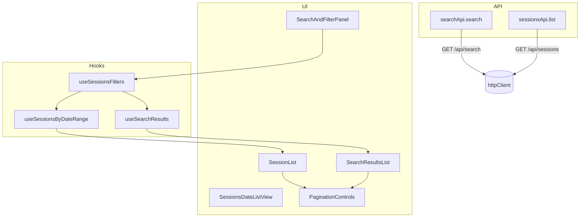
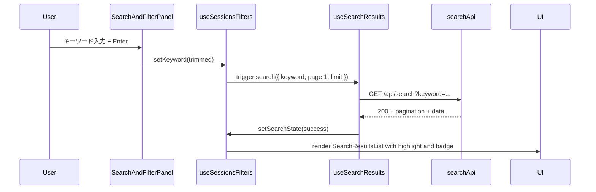
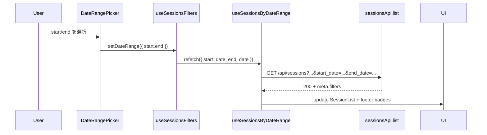
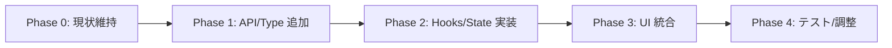

# Design Document

## Overview
Issue #23 では、既存の `SessionsDateListView` に検索・フィルタリング UX を統合し、同一画面で大量セッションを迅速に絞り込めるようにする。バックエンド既存 API（`GET /api/search`, `GET /api/sessions`）へフロントエンドが直接連携し、キーワードハイライト付きの検索結果と日付範囲でフィルタされたセッション一覧を一貫したカード UI で表示する。UX 上は日付カラムと検索カードを統合し、結果ゼロやエラー時でも状態が明確になるようステータスバナーとリトライ操作を追加する。

### Goals
- キーワード検索と日付範囲フィルタを 1 つのパネルから操作し、結果を同一ビューに統合する。
- API レスポンスのページネーション・フィルタメタ情報を UI に同期し、再取得時の状態保持とローディング表示を実現する。
- 異常系（バリデーション・タイムアウト・0件）をガードし、MSW+Vitest による TDD で全要件を検証する。

### Non-Goals
- バックエンド API 仕様の変更や新規エンドポイントの追加。
- セッション詳細ページ／タブ構造の変更（issue-21/22 で実装済み）。
- グローバル状態管理ライブラリ（Redux など）の導入やルーティング構成の刷新。

## Architecture

### Existing Architecture Analysis
- `SessionsDateListView` は `useSessionsViewModel` 経由で「日付ごとのセッション一覧＋検索入力草案」を表示。API 呼び出しは `sessionsApi.list`（日付=start/end）に限定され、ページネーションや検索結果の統合は未実装。
- `SearchInput`, `StatusBanner`, `SessionCard` などの UI コンポーネントと、`useSessionsByDate`（fetch + cache）/`useSearchDraft`（localStorage 同期）といったフックが存在する。
- API 層には `sessions.ts` のみ実装されており、`GET /api/search` 用のラッパーや型定義が無い。
- Lint/Test/Storybook は未統合。Vitest + Testing Library + MSW を使った API 層のテストは `sessions` 系のみ。

### High-Level Architecture


### Technology Alignment
- 既存の React 19 + TypeScript 5.9 + CSS Modules を継続利用。共通 fetch は `httpClient`（AbortController, retry）に統一。
- 日付ピッカーは軽量で済むためネイティブ `<input type="date">` をラップした `DateRangePicker` を自作し、外部 UI ライブラリ追加を回避。
- MSW シナリオを `frontend/src/api/__tests__/` に追加し、検索 API の 200/400/422/500 とネットワークエラーを再現。状態管理は React Hooks（`useReducer`, `useRef`）で完結させる。

### Key Design Decisions
1. **単一ビュー内での検索結果セクション表示**
   - *選択肢*: (a) 別ページ/モーダルに検索結果を表示、(b) 既存ビュー上部に検索結果セクションを重ねる。
   - *決定*: (b) を採用。`SearchResultsList` を日付一覧の上部に差し込み、キーワードが有効な間だけ表示する。
   - *理由*: 画面遷移を発生させず、issue-23 の「一覧ビューに反映する」要件と合致。アクセシビリティ的にもタブ順が単純。
2. **検索・日付フィルタの状態管理戦略**
   - *選択肢*: (a) URL クエリに同期 (router 依存), (b) ViewModel ローカル状態＋ localStorage キャッシュ。
   - *決定*: (b) を採用し、`useSessionsFilters` が `keyword`, `dateRange`, `pagination` を保持。ブラウザ更新で保持する必要は無いためルーター依存を避ける。
   - *理由*: 既存ビューがルーティングに依存しておらず、モバイル/デスクトップ共通の軽量実装が可能。
3. **検索結果キャッシュと競合リクエスト制御**
   - *選択肢*: (a) デバウンスのみ、(b) キーワード＋ページをキーにキャッシュし、`AbortController` で前リクエストを中断。
   - *決定*: (b)。`useSearchResults` で Map キャッシュと in-flight map を用意し、同一条件の同時実行を抑制、異なる条件ではキャンセル。
   - *理由*: 要件 R6.3 の「競合リクエスト抑止」を満たしつつ、頻繁なページ移動でもレスポンスの一貫性を保つ。

## System Flows

### フロー1: キーワード検索と結果描画


### フロー2: 日付範囲フィルタと一覧更新


## Requirements Traceability
| Requirement | 実現要素 |
| --- | --- |
| R1 | `SearchAndFilterPanel`, `useSessionsFilters`, `useSearchResults`, `searchApi`, `SearchResultsList` |
| R2 | `DateRangePicker`, `useSessionsByDateRange`, `sessionsApi.list` 拡張, フィルタバッジ |
| R3 | `SessionCard` 拡張（ハイライト/バッジ）, `SearchResultsList` |
| R4 | `PaginationControls`, `usePaginationState`, ローディングスケルトン/ARIA |
| R5 | `StatusBanner`, `EmptyStateView`, `errorView` 拡張, リトライ操作 |
| R6 | 新規テスト群（hooks/component/api）, MSW シナリオ, `npm run test` 追加ケース |

## Components and Interfaces

### API 層
- `frontend/src/api/search.ts`
  - `search(params: SearchParams): Promise<SearchResponse>`
  - `SearchParams = { keyword: string; page?: number; limit?: number; scope?: 'chat_messages' }`
  - `SearchResponse` 型を `frontend/src/api/types/search.ts` に定義（`data[]`, `meta.pagination`, `meta.filters`, `errors[]`）。
  - `buildSearchQuery(params)` を `queryBuilders.ts` に追加し、共通のパラメータエンコードを実施。

### フック層
1. `useSessionsFilters`
   - 管理する state: `keyword`, `dateRange`, `searchStatus`, `searchResult`, `pagination` (search/list)。
   - 外部公開: `filters`, `setKeyword`, `setDateRange`, `clearFilters`, `searchState`, `listState`。
2. `useSearchResults`
   - 入力: `{ keyword, page, limit }`
   - 状態: `status ('idle'|'loading'|'success'|'error')`, `data`, `error`, `timestamp`, `maskedKeyword`。
   - 機能: キャッシュ Map（key=`keyword|page|limit`）、in-flight Map、`AbortController`、`refetch`, `clear`。
   - API エラーは `errorView` 形式に変換。
3. `useSessionsByDateRange`
   - 既存 `useSessionsByDate` を汎用化し、`startDate`, `endDate`, `page`, `perPage` を受け付ける。
   - レスポンス `meta.filters` から UI バッジを組み立てる。

### UI コンポーネント
- `SearchAndFilterPanel`
  - 既存 `SearchInput`、新規 `DateRangePicker`、フィルタバッジ、検索実行ボタンを束ねる。
  - バリデーション文言とエラーメッセージを `aria-live` で通知。
- `SearchResultsList`
  - `SearchResultCard`（`SessionCard` のバリアント）をレンダリング。
  - 重複セッションはまとめ用バッジ（`n 件ヒット`）。
  - `PaginationControls` と連携し、検索固有のページネーションを操作。
- `SessionList` 拡張
  - 既存 `SessionCard` にハイライト/フィルタ状態を示すラベルを追加。
  - 日付フィルタ適用時はヘッダで期間を表示。
- `StatusBanner` / `EmptyStateView`
  - 検索ゼロ件と API エラー用のスタイルバリアント、再試行ボタンハンドラを受け取るように拡張。
- `PaginationControls`
  - 汎用化し、`aria-current`, `disabled`, `loading` を制御。検索/一覧どちらからでも利用可能。

## Data Models

### ViewModel 構造
```ts
interface SearchResultViewModel {
  id: string
  sessionId: string
  occurredAtLabel: string
  highlightHtml: string // SafeList 済み
  hitCount: number
  link: string // links.session
}

interface SessionsListViewModel {
  sessions: SessionListItem[]
  activeDateRange: { start: string; end: string }
  pagination: { page: number; totalPages: number }
}
```
- `highlightHtml` は backend から `<mark>` を含むため、`safeHtml` ヘルパーで `mark`, `em`, `strong`, `code`, `a` のみ許可し、`dangerouslySetInnerHTML` を使う前にサニタイズ（issue-22 の `safeHtml.ts` を再利用/拡張）。
- `hitCount` は同一 `session_id` のヒット数を計算してバッジに表示。

## Error Handling
- `searchApi` / `sessionsApi` いずれも `httpClient` の `ApiError` を `mapApiErrorToFetchError` に統一し、`code`, `status`, `retryable` を抽出。
- 422 (`invalid_parameters`) はフォーム側でフィールドハイライト、他は `StatusBanner` に詳細文言を表示。
- ネットワークエラーの場合は `lastSuccessfulSearch` / `lastSessionsList` を保持して UI が空にならないよう fallback。
- `RetryButton` は検索/一覧双方の `refetch` を受け取れるよう props を一般化。

## Testing Strategy
- **Unit**
  - `useSearchResults.test.ts`: キャッシュ命中、AbortController キャンセル、エラー伝播、0件レスポンスの ViewModel 変換。
  - `useSessionsFilters.test.ts`: バリデーション（R1.2, R2.2）、状態遷移、clear 操作。
  - `queryBuilders.test.ts`: `keyword`, `page`, `limit`, `scope`, `start/end date` のエンコード。
- **Component**
  - `SearchAndFilterPanel.test.tsx`: 入力検証、ボタン活性/非活性、`aria-live` アナウンス。
  - `SearchResultsList.test.tsx`: ハイライト描画、複数ヒット合算、ページャ操作。
  - `SessionsDateListView.test.tsx`: 日付フィルタ＋検索の統合シナリオ、ローディングスケルトン、エラー表示。
- **Integration (MSW)**
  - 正常系: 検索→結果表示→ページ変更。
  - 422: 不正 keyword / 日付逆転でフォームエラー。
  - 500/タイムアウト: バナー表示 + 再試行。
- **TDD 手順**: 各要件ごとに Red→Green→Refactor を明示（テストファイルの describe コメントで目的を記載）。CI では `npm run test` で新規ファイルを含むよう `package.json` の `test` スクリプトにパターン追加不要（既定で `src` 配下を拾うが、MSW handler は `__tests__/search.msw.ts` などで読み込む）。

## Security Considerations
- ハイライト文字列に含まれる `<mark>` 等は backend サニタイズ済みだが、フロント側でも `safeHtml` に通し `javascript:` や `on*` 属性を除去。
- API クエリ生成時は `encodeURIComponent` を使用し、ログ出力前に PII をマスク。
- ネットワーク操作は既存の `httpClient` 設定（同一オリジン, CSRF 無効）を流用。

## Performance & Scalability
- 検索結果はページごとに最大 50 件 (limit)。`useSearchResults` のキャッシュは Map サイズを 10 エントリで LRU クリア（頻出の直近検索を保持）。
- 日付一覧は既存 1 日単位 fetch を範囲 fetch に拡張するが、バックエンドの `per_page` 制御で 100 件上限。ページ切り替え時は既存キャッシュを再利用。
- Skeleton UI を活用し、ローディング体感を改善。重い JSON（ハイライト HTML）は行単位で lazy render。

## Migration Strategy

- **Phase 1**: `searchApi` と型定義を追加し、MSW モックを作成。
- **Phase 2**: `useSearchResults`, `useSessionsFilters`, `useSessionsByDateRange` を実装し、単体テストを追加。
- **Phase 3**: `SessionsDateListView` に検索結果・ページネーション・日付フィルタ UI を統合。
- **Phase 4**: コンポーネントテストとビジュアル確認、ドキュメント/README 更新。
