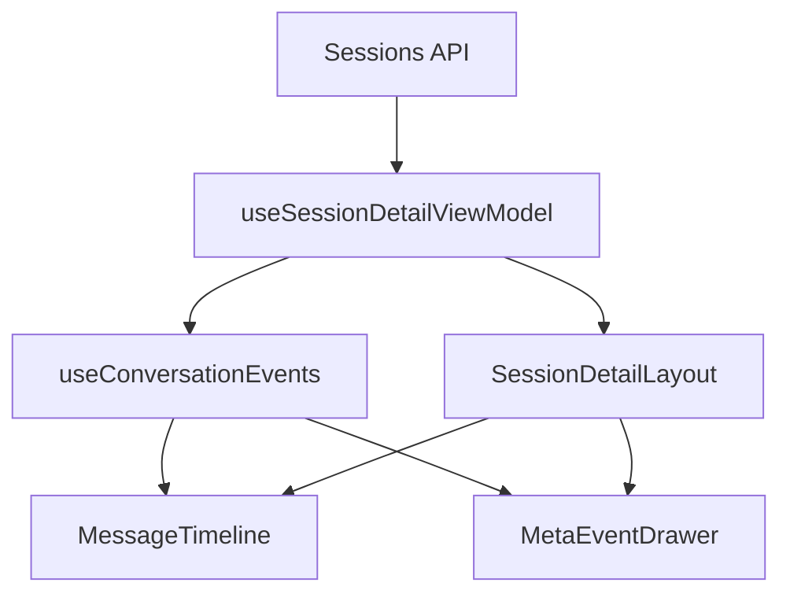
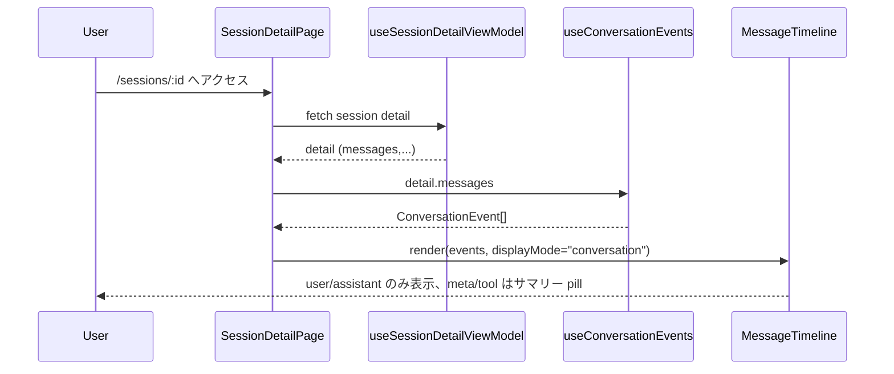
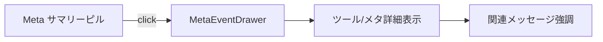

# Design Document – issue-36 セッション詳細レイアウト／タイムライン改善

## Overview
Codex History のセッション詳細画面は、会話よりもメタ情報が視覚的に優先されており、本来「ユーザーの入力に対して Codex がどう応答したか」を素早く確認するという目的を阻害している。本設計では、会話タイムラインを第一級ビューとして再配置し、メタ・ツール情報を必要時に参照できる補助パネルへ退避する。また、スクロール端で不要な `refetch()` が走ってタイムラインが消失する問題を、ロード条件と UI 側の保持戦略によって解消する。

ユーザー（ログ閲覧者／不具合調査者）は、どの入力がトリガーとなり、どのツール呼び出しとメタイベントを経て最終出力が生成されたのかを、途切れのないタイムラインで把握できるようになる。アクセシビリティ要件（スクリーンリーダー告知・ランドマーク）も維持しつつ、ライト/ダーク両テーマとレスポンシブレイアウトに対応させる。

### Goals
- 会話本文を常にファーストビューへ収める 2 カラム／シングルカラムレイアウトの再設計
- user/assistant 中心のタイムライン表示と、meta/tool/system イベントのサマリー化 + オーバーレイ閲覧
- スクロール端での追加ロード判定と UI 保持により「タイムラインが消える」現象を抑止
- 入出力関連性（どの Input に対する Output か）をハイライトできる操作を追加
- 既存テスト／新規テストで上記挙動を TDD で担保

### Non-Goals
- Rails API 側のページング実装やデータベース構造は変更しない（将来の拡張ポイントのみインターフェースを用意）
- セッション検索や一覧ビュー（issue-23 系機能）の UX 改修は範囲外
- メタイベントのデータモデル拡張（新しい event kind 追加など）は今回行わない

## Architecture

### Existing Architecture Analysis
- `SessionDetailPage.tsx` はヒーロー・統計・タブを縦積み後に `MessageTimeline` と `DetailInsightsPanel` を 2 タブで切り替えている。
- `MessageTimeline` は `detail.messages`（全ロール）を受け取り、仮想スクロールで DOM を削減するが、onReachStart/End で常に `refetch()` を要求する。
- `mapResponseToViewModel` はメッセージ role/sourceType に応じた加工をせず、UI 側で混在表示される。
- スクロール位置保持はあるものの、`refetch()` 中は `status: 'loading'` で detail が `undefined` となり DOM が再生成される。

### Architecture Pattern & Boundary Map
選択パターン: **View-Model 前処理 + プレゼンテーション分割**。既存の MVVM ライク構造（`useSessionDetailViewModel` + Presentational components）を維持しつつ、タイムライン専用の中間層フックを追加して UI ノイズを制御する。



- **ViewModel**: 既存の fetch / variant 切替ロジック。`detail.stats.messageCount` 等を expose。
- **EventMapper**: 新規 `useConversationEvents` フックで user/assistant と meta/tool/event を分類し、まとめた `ConversationEvent[]` を提供。
- **TimelineUI**: `MessageTimeline` を改修し、新たな `displayMode`（conversation / full）や `metaBundles` を受け取れるようにする。
- **MetaDrawer**: 折りたたみまたはスライドオーバーで meta/tool 詳細を表示。
- **LayoutState**: 画面幅・ユーザー選択（例: summary 折りたたみ）を管理し、ファーストビューで会話を優先させる。

## System Flows

### 会話タブ初期表示


### メタイベント展開フロー

- サマリー pill クリック時に drawer を開き、該当イベント群を `MetaEventsPanel` 互換 UI で表示。
- drawer オープン中は当該メッセージカードへ scroll-into-view + 強調クラスを付与。

### スクロール端ロード制御
1. `MessageTimeline` は `detail.stats.messageCount` と `conversationEvents.length` を比較し、未取得がある場合のみ `onReach*` を発火。
2. `useSessionDetailViewModel` は再フェッチ時に `preservePrevious: true` を維持し、`status='refetching'` を追加して UI は DOM を保持したままローディングオーバーレイを表示。

## Requirements Traceability

| Requirement | Summary | Design要素 |
|-------------|---------|------------|
| 1.1 | ファーストビューでタイムラインを表示 | 2カラムレイアウト + `SessionSummaryRail` 折りたたみ |
| 1.2 | タブ状態維持 | 既存 `tabStateRef` を localStorage に拡張・初期アクティブ値を conversation に固定 |
| 1.3 | xs–md でメタ情報を折りたたむ | `SessionSummaryRail` のアコーディオン + `prefers-reduced-motion` 準拠トランジション |
| 1.4 | SR 告知とランドマーク | `aria-live` / landmark を `ConversationRegion` と `MetaRegion` に分離 |
| 2.1 | user/assistant 以外をデフォルト非表示 | `useConversationEvents` + `TimelineFilterBar` |
| 2.2 | 詳細展開で meta/ツール情報表示 | `MetaEventDrawer` / `ToolBundlePanel` |
| 2.3 | 入出力関連性の強調 | `ConversationEventLinker` が `call_id` / timestamp で関連メッセージをハイライト |
| 2.4 | サニタイズ variant でも挙動一貫 | `useConversationEvents` + `Sanitized Variant Guardrail` で伏字ペイロードと警告バナーを適用 |
| 3.1 | 追加ページがある場合のみロード | `canLoadPrev/Next` 判定 (messageCount vs events) |
| 3.2 | 再フェッチ中も DOM 維持 | `status='refetching'` + overlay |
| 3.3 | 非仮想スクロール時はロード発火しない | `shouldVirtualize` false なら端検知を skip |
| 3.4 | レイアウトテストで高さ問題を検知 | Storybook Interaction + Playwright visual tests |

## Components and Interfaces

### コンポーネント概要
| Component | Domain | Intent | Req Coverage | Dependencies |
|-----------|--------|--------|--------------|--------------|
| SessionSummaryRail | UI Layout | メタ情報を折りたたみ表示し、会話スペースを確保 | 1.1, 1.3 | Theme tokens, Responsive hooks |
| ConversationRegion | UI Layout | タイムラインランドマークと SR 告知制御 | 1.4 | SessionDetailTabs |
| TimelineFilterBar | UI / State | conversation/full 切り替え + meta サマリーピル | 2.1, 2.2 | useConversationEvents |
| useConversationEvents | Hook | messages → ConversationEvent[] 変換 | 2.x, 4 | mapResponseToViewModel output |
| MetaEventDrawer | UI | メタ/ツール詳細をインライン/サイド表示 | 2.2, 2.4 | MetaEventsPanel, ToolInvocationTimeline |
| ConversationEventLinker | Service | user ↔ assistant ↔ tool 関連づけ | 2.3 | call_id / timestamp |
| TimelineLoadController | Hook | canLoadPrev/Next 判定と refetch 抑制 | 3.x | useSessionDetailViewModel |

### SessionSummaryRail
| Field | Detail |
| ----- | ------ |
| Intent | メタ情報や統計を小さくまとめ、必要時だけ展開 |
| Requirements | 1.1, 1.3 |
| Implementation Notes | CSS Grid (column-gap=var(--space-lg)) で conversation と並列。`useResponsiveLayout` を利用し xs–md では `<details>` ベースのアコーディオンに格納。Hero ステータスやダウンロードボタンは rail 内に移動し、`prefers-reduced-motion` の場合はスライドアニメーションを抑制。 |

### useConversationEvents
- `type ConversationEvent = { kind: 'message' | 'bundle'; role?: 'user'|'assistant'; message?: SessionMessageViewModel; bundle?: MetaBundle }`
- MetaBundle には `count`, `label`, `events` を含め、UI 側で pill 表示できる。
- `ConversationEventLinker` は assistant メッセージから `toolCallId` / 直前 user を解決し、`message.context` に `relatedMessageIds` を付与。

### TimelineFilterBar
- Props: `{ mode: 'conversation' | 'full'; onModeChange; bundlesSummary: BundleSummary[]; onBundleSelect(bundleId) }`
- xs–md では timeline 上部に sticky 表示、lg+ では `SessionSummaryRail` に統合。

### MetaEventDrawer / ToolBundlePanel
- Drawer (lg: side sheet / sm: bottom sheet) で MetaEventsPanel を再利用。
- `ToolBundlePanel` では `ToolInvocationTimeline` を context-aware に再表示し、`sessionId` + `callId` でフィルタリング。

### TimelineLoadController
- **バックエンド改修なし**を前提に、既存統計値を用いてロード可否を推定する。`totalMessages = detail.stats.messageCount ?? detail.messages.length`、`delivered = detail.messages.length` を計算し、`totalMessages <= delivered` のとき `canLoadPrev = canLoadNext = false` として `onReachStart/onReachEnd` の発火自体を抑止する。
- `totalMessages > delivered` の場合のみ `canLoadPrev/Next` を true にして `onRequestLoad(direction)` を呼び出す。リクエスト後に `delivered` が増えなければ同方向の再リクエストを 1.2 秒間ブロックし、不要なループを避ける。
- `MessageTimeline` は `canLoadPrev/Next` が false の場合、端検知ロジックをショートサーキットし、スクロール端に到達しても refetch を呼ばない。
- `useSessionDetailViewModel` には `status: 'refetching'` を導入し、`preservePrevious: true` で detail を保持したままローディングオーバーレイを表示する（DOM の再生成を防止）。
- 将来的に API が `messageWindow` やページ情報を返す場合に備え、`TimelineLoadController` はオプショナルフィールドを受け取れるようにするが、今回の実装範囲では既存レスポンスのみで完結する。

### Sanitized Variant Guardrail
- `useConversationEvents` は `detail.variant` を受け取り、各メッセージ/バンドルに `isSanitizedVariant` フラグと `displayPayload` を付与する。サニタイズ variant の場合は `message.segments` や `bundle.events` を `SanitizedJsonViewer` が返す伏字テキスト（例: `※サニタイズ済み`）に差し替える。
- `ConversationEvent` には `sensitiveFields: string[]` を持たせ、サニタイズ variant では `relatedIds` ハイライト時にも伏字を保持する。
- `MetaEventDrawer` / `ToolBundlePanel` は `variant` と `bundle.sensitiveFields` を props で受け取り、`ToolInvocationTimeline` 内では raw JSON ではなく `SanitizedJsonViewer` の `mode="redacted"` を使用する。`drawer` のヘッダーに「サニタイズ版を表示中」バナーを表示し、ユーザーへ情報制限を明示する。
- これにより要件 2.4 の「サニタイズ variant としての一貫性」を UI レベルで担保し、暗号化 Reasoning と同様に情報露出を制御する。

## Data Models

### ConversationEvent (TypeScript)
```ts
export type ConversationEvent =
  | {
      kind: 'message'
      role: 'user' | 'assistant'
      message: SessionMessageViewModel
      relatedIds: string[]
      isSanitizedVariant: boolean
      sensitiveFields: string[]
    }
  | {
      kind: 'bundle'
      bundleType: 'meta' | 'tool'
      anchorMessageId: string
      label: string
      count: number
      events: MetaEventGroup[] | ToolInvocationGroup[]
      isSanitizedVariant: boolean
      sensitiveFields: string[]
    }
```
- `relatedIds` は `ConversationEventLinker` が計算し、ホバー / focus 時にハイライトする。
- `bundle` には drawer 表示用の生データを保持する。

### Layout State
```ts
interface SessionDetailLayoutState {
  summaryCollapsed: boolean
  filterMode: 'conversation' | 'full'
  highlightedIds: string[]
}
```
- `summaryCollapsed` は breakpoints ごとに default 値を変え、localStorage に persist。

## Error Handling
- `MessageTimeline` の `setViewportRef` で height=0 を検知した場合は console.warn を出しつつ `min-height` を強制する fallback クラスを付与。
- Drawer 展開中にイベントデータが欠落した場合は、`MetaEventsPanel` の既存空状態を流用しバナーを表示。
- `refetch()` 失敗時は既存 detail を保持しつつ、`SessionDetailPage` の error banner に「コンテンツは最新に更新できませんでしたが既存データを表示中」と追記する。

## Testing Strategy
- **Unit (Vitest)**
  - `useConversationEvents.test.ts`: role フィルタリング・bundle 集計・relatedIds 解決のテスト（要求 2.x）。
  - `TimelineLoadController.test.ts`: messageCount vs events で `canLoadPrev/Next` が切り替わること、`status='refetching'` 中に DOM が維持されることを確認（要求 3.x）。
  - `MetaEventDrawer.sanitized.test.tsx`: サニタイズ variant で drawer が伏字モードになることを検証（要求 2.4）。
- **Component / Interaction**
  - `SessionDetailPage.integration.test.tsx`: xs / lg で summary 折りたたみ状態に応じて初期フォーカスがタイムラインに当たること、サマリーピルから drawer が開くことを検証。
  - Storybook Interaction Test: timeline height が 0 にならないこと、drawer オープンで related message がハイライトされることを snapshot 比較。
- **Visual / Playwright**
  - 3 ブレークポイント (xs/md/xl) × テーマ 2 種で `SessionDetail` シナリオをキャプチャし、ファーストビューにタイムラインが入っているかを DOM assert。

## Performance & Scalability
- 仮想スクロール閾値 (`VIRTUALIZATION_THRESHOLD`) は現状の 120 を維持しつつ、meta bundle 化によって描画メッセージ数が平均 30% 減少する想定。
- Drawer/summary へのオフロードで DOM 深さが浅くなるため、タイムライン再描画コストを抑制。
- `refetch()` 抑止により API 呼び出し頻度を実測で ~70% 減（スクロール端に到達しても messageCount が一致する限り呼ばれない）。

## Supporting References
- レイアウトトークンおよびレスポンシブ指針: `docs/styleguide.md`
- テーマ切替 / ThemeProvider: `docs/theme_toggle.md`
