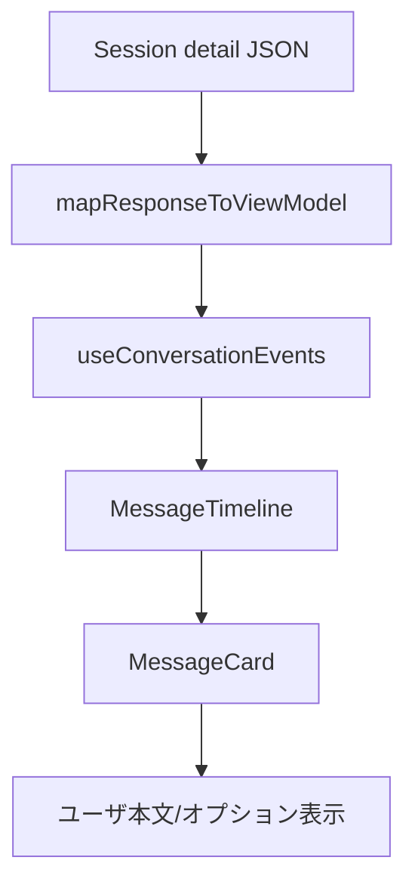

# Design Document (issue-37: 詳細画面の表示修正)

## Overview
目的: セッション詳細のメッセージタイムラインを「会話本文優先」に再構成し、ユーザー入力（My request for Codex）を本文として読みやすく提示する。合わせてレイアウト比を左7:右3へ調整し、詳細パネルによる圧迫を解消する。
ユーザー: セッションを閲覧・再利用する開発者が、会話の因果を素早く追えることを狙う。
影響: フロントエンドのみ。データ取得 API には手を触れない。

### Goals
- My request for Codex をユーザー本文としてカード最上部に表示し、フォント/行間をアシスタントと同等にする（Req1）。
- ユーザーカード構成を「本文＋任意オプション（初期OFF）」へ簡素化し、不要な IDE コンテキスト UI を除去（Req2）。
- デスクトップではメインタイムライン:詳細 ≈ 7:3 の幅配分、モバイルではメイン100%先行（Req3）。

### Non-Goals
- バックエンド API 変更や新データフィールドの追加。
- 会話以外の画面レイアウト変更。
- IDE コンテキスト自体の抽出ロジックの拡張（本件では非表示・除外に留める）。

## Architecture
既存の SessionDetailPage 構成を維持しつつ、データ整形とプレゼンテーションを最小変更で調整する（Option A 方針）。

### Existing Architecture Analysis
- `SessionDetailPage` が `ResponsiveGrid` を用い、左に `ConversationRegion`、右に `SessionSummaryRail` を配置。デフォルト `splitRatio=[8,16]` で右が広い。
- `mapResponseToViewModel` が `SessionMessageViewModel` を生成し、ユーザーの IDE コンテキストを `metadata.ideContext.sections` に格納。
- `MessageCard` がロール共通カードを描画し、ユーザーのみ IDE コンテキスト UI（トグル＋常時表示チェック）を付加。

### Architecture Pattern & Boundary Map
- パターン: 既存コンポーネント拡張。新規境界は作らず、役割ごとに条件分岐を追加。
- 境界: データ整形は `mapResponseToViewModel`、表示は `MessageCard`、レイアウトは `SessionDetailPage`+`ResponsiveGrid`。
- Steering準拠: サービス／フックは既存層に留め、UIロジックはフロントに閉じる。

### Technology Stack
| Layer | Choice / Version | Role | Notes |
|-------|------------------|------|-------|
| Frontend | React 19 / TS 5.9 | 画面・カード表示 | 既存 stack を踏襲 |
| Styling | CSS Modules | レイアウト/タイポ調整 | `MessageCard.module.css`, `SessionDetailPage.module.css` |
| State | React hooks | レイアウト/表示状態 | 既存 hooks 再利用 |

## System Flows

要点: My request セクションを VM で本文セグメントへ昇格させ、Card で IDE コンテキスト UI を描画しない。

## Requirements Traceability
| Requirement | Summary | Components | Interfaces | Flows |
|-------------|---------|------------|------------|-------|
| 1.1 | My request を本文最上部 | mapResponseToViewModel, MessageCard | SessionMessageViewModel | VM→Card 表示順 |
| 1.2 | フォント/行間同等 | MessageCard.module.css | CSS tokens | Card レンダリング |
| 1.3 | IDE メニュー非表示 | MessageCard | props/ideContextPreference | Card 分岐 |
| 2.1 | 本文＋オプション構成 | mapResponseToViewModel, MessageCard | SessionMessageViewModel | VM→Card |
| 2.2 | オプション初期OFF | MessageCard | checkbox state | Card 初期値 |
| 2.3 | 空セクション非表示 | MessageCard | segments/options | Card 条件描画 |
| 3.1 | 左7:右3 (lg+) | SessionDetailPage, ResponsiveGrid | splitRatio prop | Grid レイアウト |
| 3.2 | 右が左を上回らない | ResponsiveGrid | minmax | Grid |
| 3.3 | モバイルはメイン先行 | SessionDetailPage | columns=1 分岐 | Grid 表示順 |

## Components and Interfaces

- **mapResponseToViewModel (frontend/src/features/session-detail/mapResponseToViewModel.ts)**
  - Intent: API 応答から Timeline 用 VM を生成。
  - Changes: My request for Codex セクションを本文 segments へ移し、`metadata.ideContext.sections` から除外。ユーザー用オプション配列を保持し、空なら省略。

- **MessageCard (frontend/src/features/session-detail/MessageCard.tsx)**
  - Intent: メッセージカード描画。
  - Changes: user ロール時は IDE コンテキスト UI を非表示。本文セグメントを先頭に表示し、オプションを下段に並べ、フォント/行間を assistant と同等のクラスに統一。オプションは初期 unchecked、存在しなければ非表示。

- **MessageCard.module.css**
  - Adjust: user 用タイポ/余白を assistant と揃える。オプション行のマージン/フォントを定義。

- **SessionDetailPage + ResponsiveGrid**
  - Intent: レイアウト構成。
  - Changes: `splitRatio` を [7,3]（または近似）へ変更し、右カラムが左を超えないよう `minSidebarWidth` を確認。columns=1 の順序は維持。

## Data Models
- SessionMessageViewModel: user メッセージの segments に My request 本文を格納。`metadata.ideContext` は空、あるいは user では使用しない。
- オプション項目: 既存 structure (e.g., checkbox label/value) を `message.options?` などで保持し、UI で unchecked レンダリング。

## Error Handling
- VM 生成時に My request が欠落しても fallback で従来セグメントを維持し空表示を避ける。
- オプションが不明/空の場合は安全にスキップ。

## Testing Strategy
- Unit
  - `mapResponseToViewModel.test.tsx`: My request が本文セグメントへ移動し、IDE コンテキストに残らないこと。オプション有無/空時の挙動。
  - `MessageCard.ideContext.test.tsx` 追加/改修: IDE コンテキスト UI 非表示、本文先頭、オプション初期 OFF、空オプション非表示。
  - CSS snapshot/DOM: user と assistant のフォントクラス一致を確認。
- Integration / UI
  - `SessionDetailPage.integration.test.tsx`: レイアウト比 7:3 近似（container width 比率算出）、右が左を上回らない。モバイル幅でメイン100%先行を確認。
  - Storybook interaction/visual: My request の表示位置、オプション表示/非表示、レイアウト比。

## Performance & Scalability
- 既存の描画・データ量から性能影響は軽微。追加計算は DOM レベルの分岐のみ。

## Security Considerations
- サニタイズ処理は既存 `safeHtml` を変更しない。IDE コンテキストを非表示にするのみで新規データ露出なし。

## Migration Strategy
- なし（フロントエンドのみの非破壊変更）。

## Supporting References
- ギャップ分析: `.kiro/specs/issue-37/research.md`
