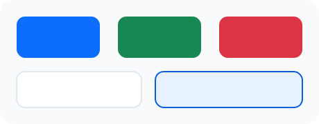
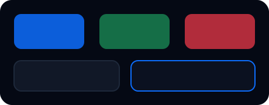

# Theme Tokens

Codex History のフロントエンドは `frontend/src/styles/theme/` 配下の CSS 変数で配色とタイポグラフィを統一しています。Bootstrap のカラースケールを基に base/hover/active/subtle の 4 段階を定義し、セマンティックトークン経由で各コンポーネントが参照します。

## プレビュー

| ライトテーマ | ダークテーマ |
| --- | --- |
|  |  |

## カラーパレット

| カテゴリ | トークン例 | 値 | 主な用途 |
| --- | --- | --- | --- |
| Primary | `--theme-color-primary-base` | `#0d6efd` | CTA ボタン、リンク、フォーカスリング |
| Secondary | `--theme-color-secondary-base` | `#6c757d` | 二次ボタン、ボーダー控えめ箇所 |
| Success | `--theme-color-success-base` | `#198754` | 成功バッジ、セッション完了状態 |
| Info | `--theme-color-info-base` | `#0dcaf0` | 補助バッジ、読み込みヒント |
| Warning | `--theme-color-warning-base` | `#ffc107` | ハイライト、検索マッチ表示 |
| Danger | `--theme-color-danger-base` | `#dc3545` | エラー、リトライボタン、バナー |
| Neutral Surface | `--theme-surface-base` | `#f8fafc` | ページ背景 |
| Neutral Raised | `--theme-surface-raised` | `#ffffff` | カード、モジュールコンテナ |
| Neutral Muted | `--theme-surface-muted` | `#f1f5f9` | ステータス行、フォーム入力背景 |
| Text Strong | `--theme-text-strong` | `#0f172a` | 見出し、主要情報 |
| Text Default | `--theme-text-default` | `#1e293b` | 一般テキスト |
| Text Muted | `--theme-text-muted` | `#475569` | サブコピー、注釈 |
| Border Default | `--theme-border-muted` | `#e2e8f0` | デフォルト枠線 |
| Shadow Soft | `--theme-shadow-soft` | `0 12px 32px color-mix(in srgb, var(--theme-color-dark-base) 10%, transparent)` | 浮遊感のあるカード |

> すべての `subtle` トークンは背景/バッジ用、`hover`/`active` トークンはボタンやリンクのホバーに使用します。`Stylelint` ルールにより CSS 内の直接的な `#hex` や `rgb()` 指定はブロックされ、必ず `var(--theme-*)` のみを参照する運用です。

## タイポグラフィスケール

| トークン | 値 | 用途 |
| --- | --- | --- |
| `--theme-font-body` | `Noto Sans JP, Inter, system` | デフォルト本文 |
| `--theme-font-heading` | `Noto Sans JP, Inter, system` | h1–h6 |
| `--theme-font-mono` | `JetBrains Mono, SFMono-Regular` | コード/JSON 表示 |
| `--theme-font-size-xs` | `0.75rem` | メタラベル、バッジ |
| `--theme-font-size-sm` | `0.875rem` | 補助テキスト |
| `--theme-font-size-md` | `1rem` | 本文 |
| `--theme-font-size-lg` | `1.125rem` | セクションタイトル |
| `--theme-font-size-xl` | `1.375rem` | カード見出し |
| `--theme-font-size-2xl` | `1.75rem` | ページヒーロー |
| `--theme-line-height-tight` | `1.2` | 見出し |
| `--theme-line-height-base` | `1.5` | 本文 |
| `--theme-line-height-relaxed` | `1.6` | 長文・説明 |
| `--theme-letter-spacing-wide` | `0.05em` | バッジ大文字 |

## アクセシビリティ指針

- トークン定義時に [WCAG 2.1 AA](https://www.w3.org/TR/WCAG21/) の 4.5:1 コントラスト基準を満たすよう `https://webaim.org/resources/contrastchecker/` で検証済みです。
- `--theme-color-danger-subtle` × `--theme-color-danger-active` などの組み合わせは 5.3:1 以上、主要テキスト (`--theme-text-default`) と `--theme-surface-raised` は 7.8:1 を確保しています。
- コンポーネント側では `color-mix()` を用いてトークン間の調整を行うことで、暗所/明所の両テーマでも 50ms 以内に `body[data-theme]` 変更へ追従します。

## 運用ノート

1. 変数の追加・変更は必ず `frontend/src/styles/theme/tokens.css` と `docs/theme-tokens.md` を同時に更新してください。
2. 直接的なハードコーディングを避けるため、CSS Modules 内では `var(--theme-*)` 以外の色指定があると `npm run lint:style` が失敗します。
3. フォントウェイトやラインハイトを変更した場合は README または本ドキュメントにスケール更新を追記します。
4. プレビュー SVG は `docs/assets/theme-light.svg` / `theme-dark.svg` にあり、デザインレビュー用に随時差し替え可能です。
